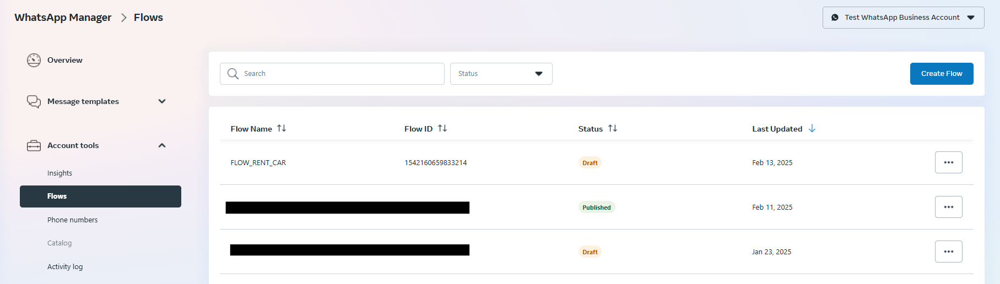

# Nikk's Car Rental
An example WhatsApp ChatBot powered by pywce

## Features
1. Rent a car
2. Pay for car rental
3. View current rented cars
4. Help
5. Report Issue
6. Enquiry

## Setup
> [!NOTE]
> [Knowledge of & a WhatsApp Flow](https://developers.facebook.com/docs/whatsapp/flows) enabled account is required

Ensure you have your WhatsApp account set properly. [Checkout this tutorial here](https://www.youtube.com/watch?v=Y8kihPdCI_U)

The project uses WhatsApp Flows for the car rental screen.

You can find the example [WhatsApp Flow json here](flows) that you can copy and paste in your account Flows.



## Run
```bash

$ fastapi dev main.py
```

