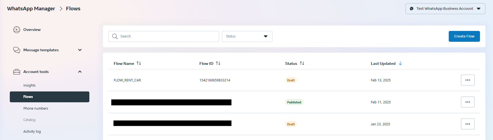

# Road.SOS 🆘
Your friendly road SOS chatbot

## Features
1. Register for SOS service
2. Report an accident
3. Request road angel
4. View emergency numbers
5. Report Issue

## Setup
> [!NOTE]
> [Knowledge of & a WhatsApp Flow](https://developers.facebook.com/docs/whatsapp/flows) enabled account is required

Ensure you have your WhatsApp account set properly. [Checkout this tutorial here](https://www.youtube.com/watch?v=Y8kihPdCI_U)

You can find the example [WhatsApp Flow json here](flows) that you can copy and paste in your account Flows.



## Run
```bash

$ fastapi dev main.py
```

