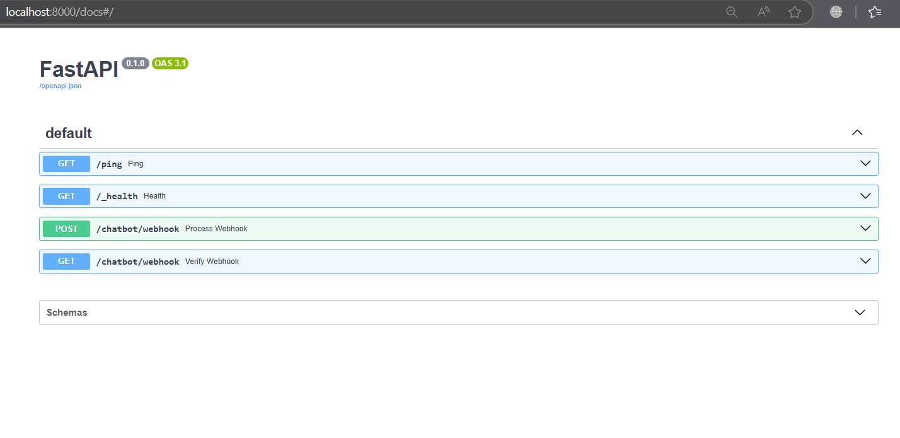
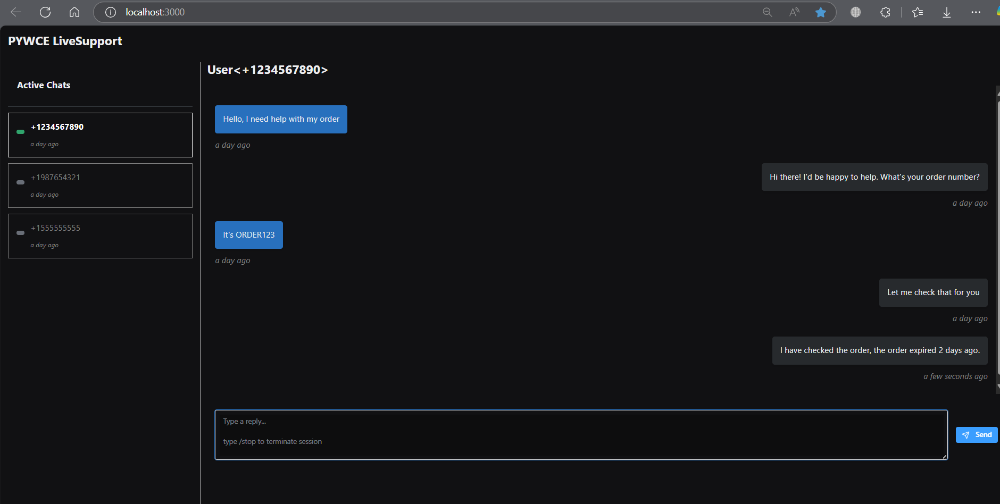

# Pywce LiveSupport Portal
An ehailing WhatsApp chatbot with live support portal powered by [Reflex](https://reflex.dev)

> [!WARNING]
> This is a WIP, basic live-support portal.

## Features
- [x] Request live support from chatbot 
- [x] Message persistence (conversations are saved in default sqlite3 db)
- [x] Termination command to end live support
- [x] Chat selection
- [ ] Alert on new incoming request
- [ ] Archive inactive chats
- [ ] Revamp portal / chat interface
- [ ] Agent / Admin login
- [ ] Support multiple agents / admins
- [ ] Support sending other supported message types e.g. media or buttons
- [ ] Support replying specific message

## Setup
> [!IMPORTANT]  
> Checkout [chatbot setup guide](https://github.com/DonnC/pywce?tab=readme-ov-file#setup) for credentials setup

`The portal project might misbehave on Windows, try any unix OS`

> Ensure you have **Redis** setup and running

1. Clone this repository
2. cd into `portal` and install dependencies
```bash
$ pip install -r requirements.txt
```
To install the engine, `cd` back to root folder with `setup.py` and do
```bash

$ pip install -e .
```
3. Initialize db and create migrations
```bash

$ reflex db init
$ reflex db makemigrations --message 'initial setup'
$ reflex db migrate
```
4. Seed - add few conversations to begin with
```bash

$ python seed.py
```
5. Run
```bash

$ reflex run
```

## Live Support
To invoke live support after everything runs well, type `human` in the chat.

## Result
Backend endpoints


Basic Portal



## Support
Thank you, if you like or find my work helpful to you.
Your support goes a long way in taking this work further, be it sharing with your network, staring the repository, contributing or even financial support - I appreciate any form of support.

You can use [paypal](https://www.paypal.me/donnclab) 

or get in touch with me on [donychinhuru@gmail.com](mailto:donychinhuru@gmail.com)

## Contributing

We welcome contributions! Please check out the [Contributing Guide](https://github.com/DonnC/pywce/blob/master/CONTRIBUTING.md) for details.
